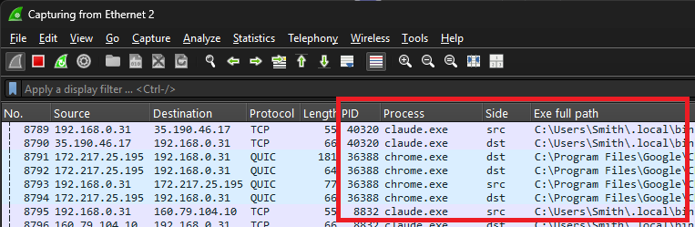

# wireshark-process-dissector

See which process sent or received each packet in Wireshark, and filter on it.

Windows, Linux and macOS. A single Lua file.



## Download

Get `process_dissector.lua` from the [releases](https://github.com/fiddyschmitt/wireshark-process-dissector/releases/latest) section and copy it to your personal Lua plugins folder (Help → About Wireshark → Folders → Personal Lua Plugins). Restart Wireshark.

## Fields

To show a field as a column, right-click it in the packet details and choose *Apply as Column*.

| Field | Description |
|---|---|
| `process.pid` | Process ID |
| `process.name` | Process name / executable filename |
| `process.service` | Windows service short name(s) the process hosts, e.g. `Dnscache` — Windows only |
| `process.service_display` | Service display name(s), e.g. `DNS Client` — Windows only |
| `process.path` | Executable full path |
| `process.folder` | Executable folder |
| `process.filename` | Executable filename |
| `process.cmdline` | Command line |
| `process.side` | `src` or `dst` — which end of the packet the process owns |

## Example filters

```
process.name == "chrome.exe"
process.path contains "python"
process.cmdline contains "--proxy"
process.side == "src" && process.pid == 1234
process.service == "Dnscache"
process.service_display contains "DNS"
```

## How it works

Packets carry no process information, so the dissector maps each packet's local endpoint to the socket table.

- **Windows / macOS**: a small helper (embedded in the Lua file) runs hidden, polls the socket table every 250 ms, and exits when Wireshark closes.
- **Linux**: reads `/proc` directly. No helper.

Long-lived connections resolve reliably. A socket that opens and closes between two polls can be missed. Other users' processes need root / admin (see Preferences → Protocols → Process Info).

On **Windows, when Wireshark runs elevated**, the helper also consumes Kernel-Network connect/accept events, so short-lived connections between polls are caught too. It enables an isolated, bounded, circular Analytic log while capturing and disables it on exit — no persistent change. Turn it off with the "use connection events when elevated" preference.

## Tests

```
tshark -X lua_script:tests/run_tests.lua -r tests/empty.pcap   # unit tests: parsing, cache, launch, socket fixtures
sh tests/dissect_check.sh <tshark>                             # offline: dissect a fixture pcap, assert fields per socket type
sh tests/pktap_check.sh <tshark>                               # offline: assert macOS pktap process metadata is mirrored
```

Live-capture checks are in `tests/live/`. `comprehensive.ps1` (Windows) and `comprehensive.sh` (Linux/macOS) exercise TCP+UDP over IPv4+IPv6, listening and connected, on loopback, and assert every field is populated for every socket type. `service_check.ps1` confirms Windows service fields resolve on a 60&nbsp;s live capture, and `multi_instance.{ps1,sh}` confirm two instances run at once on every platform (one shared helper on Windows/macOS, no helper on Linux). `exact_mode_check.ps1` validates the elevated Windows connection-events path (needs an elevated shell). `test_env/` stands up a throwaway Linux desktop VM for testing.
